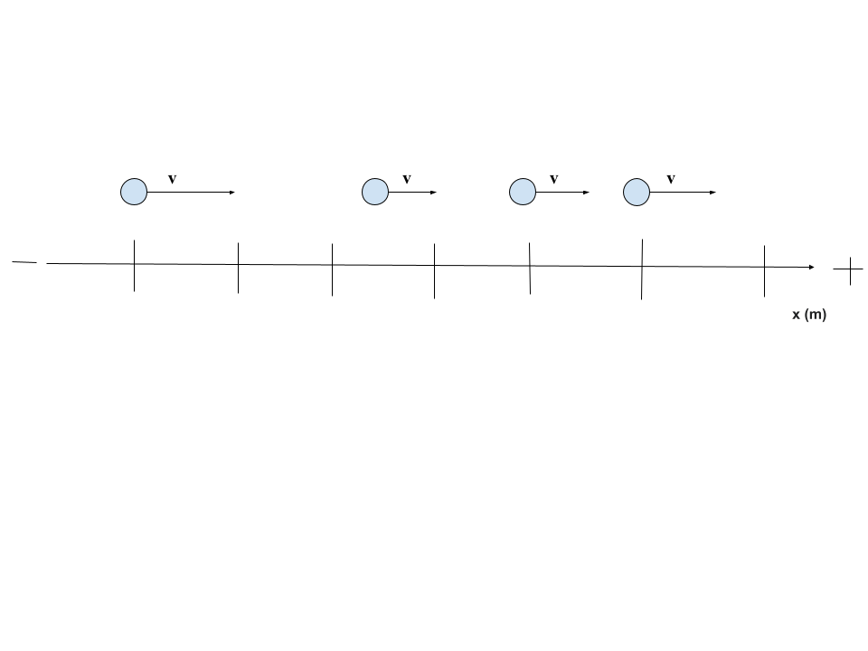
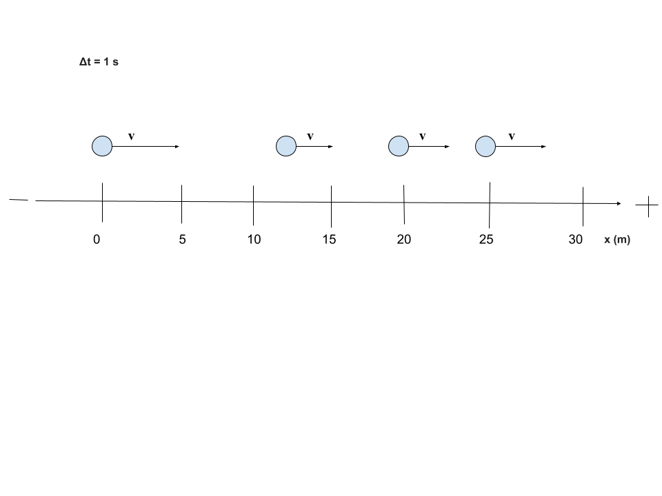
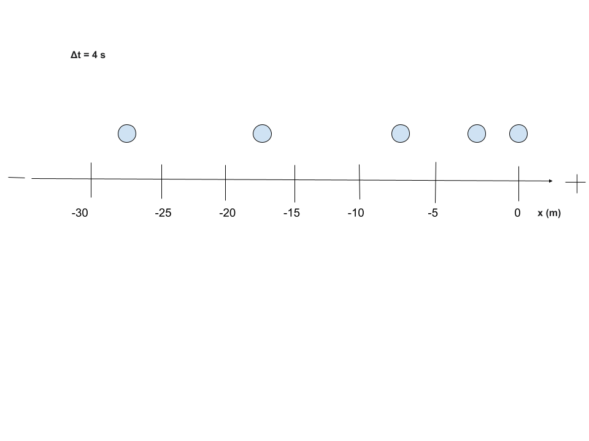
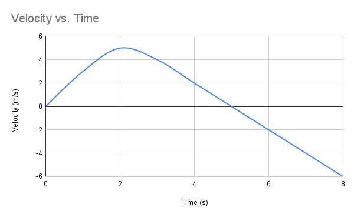
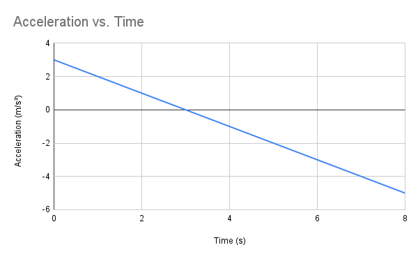
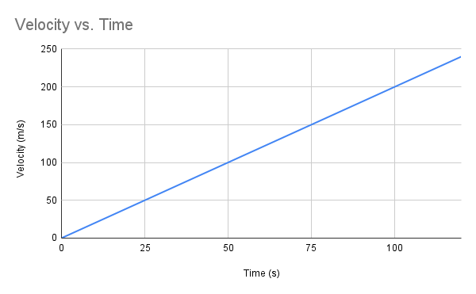

Welcome! I am delighted to be your mentor through one of the hardest classes you will take in high school, but by the end of your experience, these tricky concepts will transform into basic logic. College Board has notoriously made this course one of its most challenging, but after you give me a little bit of your time and attention each day, I guarantee that you will get something out of this. It is my passion to help students feel less pressure in the classroom, so I made this guide as beginner-friendly as possible. Let's start with Unit 1: Kinematics.

# UNIT 1: KINEMATICS 

## Lesson 1

Before we start, let's learn a few essential key points and definitions. Kinematics combines algebra and geometry to analyze motion in objects but ignores the effects of forces, which will play a role in an object's motion as the course develops.

### Key Terms and Definitions

#### Scalar - a physical quantity that only has magnitude (no direction)

* Speed - how fast an object is moving, the rate at which it covers distance
* Magnitude - the size or strength of a physical quantity, without reference to direction
* Temperature - a measure of the average kinetic energy of the particles in a substance
* Volume - the amount of space an object occupies
* Energy - the ability to do work or cause change
* Mass - measure of matter in an object
* Distance - the total length that an object has traveled

#### Vector - a physical quantity that has magnitude AND direction

* Velocity - the rate of change of position
* Acceleration - the rate of change in velocity
* Position - the location of an object in a 1d or 2d shape
* Displacement - the change of position over time

### Symbols

#### Velocity
$\vec{v}$

#### Acceleration
$\vec{a}$

#### Position
$\vec{x}$

#### Displacement
$\Delta\vec{x}$

Now, I want you to look carefully at these symbols and try to identify which are vector quantities and which are scalar quantities.

    
Click here when you have your answer in mind

Actually, they are all vector quantities! If we scroll above, we will see that scalar quantities do not have direction, while vector quantities do. The arrow above each variable represents direction in physics. The variable itself represents magnitude, which is the only factor that makes up a scalar quantity.

Next, I want you to think of the term scalar, how can we transform a vector quantity into a scalar quantity? Remember its definition and key points, a scalar value only represents a vector's magnitude. In other words, we can remove the arrow from each vector quantity to create a scalar quantity. For example, $v$ no longer represents velocity, it now represents speed which is the magnitude of velocity, all because the arrow was removed. Not every scalar quantity of a vector has a name, however, so we can just say magnitude of acceleration to prove our point.

### Key Takeaways

* Magnitude is always positive
* Scalar and vector quantities are closely related, but different in definition
* Arrow represents direction
* Variable represents magnitude
* $\Delta$ represents change over time

### Further Information

* Vectors can be positive or negative values
* Basic scalar quantities are positive
* The point of reference (reference point) is usually set to 0 and represents the **initial position** of an object
* The conventional coordinate system follows a left/down = negative and right/up = positive pathway
* Make sure you can visualize every physics problem!

### Think Like a Physicist

This section will be present in each lesson and is used to cover conceptual physics. Of course, the material above is essential to a full understanding of the situation below:

**A truck hits its brakes too late and stops past an intersection onto the crosswalk. The vehicle then backs up at constant acceleration until it comes to a full stop behind the pedestrian walkway. Describe the magnitude of acceleration and velocity (speed).**

    
Click here when you have your answer in mind

**The magnitude of acceleration is not changing since it is constant in this scenario, but the magnitude of velocity (speed) is increasing steadily due to constant acceleration and a gradual gain of speed.** Even though the direction of velocity and acceleration is negative, the magnitude must stay positive and reflect only the quantity of a vector without reference to direction, which can be referred to as the scalar portion. An easy way to find the magnitude of any vector value is to take its absolute value.

### Practice

[Let's test your knowledge, take the vector & scalar quiz here](Quiz.html)

## Lesson 2

Now that we have a basic understanding of kinematics concepts, we can start learning the numbers aspect of the unit. Let's get familiar with a few equations while visualizing each variable at play. But remember to focus more on understanding physics conceptually, not mathematically.

### Specific Variables

* $\vec{v}_inst$ ---> (represents the instantaneous velocity of a motion graph at a single point in time, found by calculating the slope of a straight, linear line)

* $\vec{v}_avg$ = $\Delta x / \Delta t$ ---> (represents the average velocity of a motion graph over the whole time period)

* $\Delta v = v_f - v_i$ ---> (represents the change in velocity over a chosen time interval on a motion graph)

* $a = \frac{\Delta v (v_f - v_i)}{\Delta t}$ ---> (represents acceleration or the rate of change in velocity)

### Algebra in Physics

Algebra is central to AP Physics 1, but it is not the only factor when dealing with numbers in the course. Most problems you will encounter are not in plug-n-chug style but rather require a more intuitive, conceptual understanding of each variable's role in physics scenarios. Let's learn a few diagrams and graphs to solidify conceptual and algebraic comprehension.

The image above is called a motion diagram. These typically do not involve numbers and, therefore, rely on conceptual intuition, so try and figure out how each variable works to form a motion diagram as I explain. The arrows are pointing to the right, which in this coordinate system, represents the positive direction. We can safely say that the object (let's say car for this example) is not going backwards but rather forwards. The dots represent the vehicle's position, which increases over time, and the length of the arrows represents velocity. The car's initial velocity is higher than its velocity during the rest of the trip, meaning the vehicle decelerated to maintain a constant velocity after its initial recorded position and velocity. We can see this because, at first, the arrow goes from one vertical line to the next but then gets shorter and goes from half of a vertical line to the next and so forth.

Let's take a look at another conceptual diagram but in reference to time:

Notice the $\Delta t$. Each time interval, or the time between each dot, is one second. The first dot will always represent zero seconds. In this case, we are going forwards to keep the concepts simple, but if we were going backwards then 0 seconds would start to the far right rather than the far left. The velocity would be negative and the distance data, or x axis, would be different as well.

How much of the initial velocity is the constant velocity?

A. 2 times as much

B. $\frac{1}{2}$ as much

C. 4 times as much

D. $\frac{1}{4}$ as much

    
Click here when you have your answer in mind

**Correct answer: A.**

Since the constant velocity will be the same amount each time (2.5 m/s), we can compare any of its intervals to the initial velocity of 5 m/s, remember that we get these values because velocity is defined as the rate of change of position (displacement) per second. 5 is two times the amount of 2.5, so that makes A the correct answer.

Let's take a look at simpler models called oil-drop or particle diagrams. Since motion diagrams are more complex, see if you can interpret the example below:

With limited information, I want you to describe the direction and speed of the object. For more advanced students, try to interpret the acceleration too. Once you have it figured out, check your answers below. Hint: the model is very similar to a motion diagram.

    
Click here when you have your answer in mind

Remember that speed only deals with magnitude, meaning it will be positive regardless of direction. **The speed of the object is increasing because each dot is spacing out more and more, or in other words the position is increasing after each interval, which is four seconds between every dot.** The object is becoming more negative, which means vectors like velocity and acceleration will be negative values. **Now that we have determined the direction to be negative,** we can look at the magnitude of acceleration. The change of position, or displacement, is doubling each time which makes velocity (the rate of change of position, or displacement) increase. **Since velocity is not increasing by the same value each time but instead increasing exponentially (2 times each interval) then that makes acceleration an increasing value not a constant one.** Note that acceleration is getting more negative, it is not increasing in the positive direction.

### Position vs. Time

The graph above represents position vs. time. These are effective at describing three variables. Can you figure out the third one? It's velocity! Specifically, the slope of the graph is, so this graph shows more than at first glance. One can find the instantaneous and average velocity just from this graph. Instantaneous velocity is found by drawing a tangent line at the point of interest and calculating the slope of it. Average velocity is found only along a certain time interval from one point to another, which can be from start to finish or from two particular points of interest. **Try to find the average velocity from 0s to 4s.** We will discuss instantaneous velocity in a moment.

    
Click here when you have your answer in mind

**The average velocity from 0s to 4s is 5 m/s.** If we calculate the average velocity from t = 0s to t = 10s, we will get the same value. This is because the line is linear, or from a physics standpoint, the velocity is constant. The slope will be the same from any time interval. Since velocity is constant, acceleration will come out to zero (no acceleration present).

Now let's focus on instantaneous velocity. Remember that we can calculate this type of velocity by finding a straight, linear segment of a graph. Without calculus, this method is the only way to find instantaneous velocity. In our case, the whole graph is linear, meaning the instantaneous velocity will be the same throughout. If a graph is curved without any linear segments, instantaneous velocity cannot be calculated algebraically. So, my advice: always look for the linear part of the graph when you’re asked about instantaneous velocity. It makes the job way easier!

### Acceleration Deep-Dive

Let's take a closer look at acceleration to conceptually understand its components. Of course, we cannot do that without referencing velocity. So, we will be taking analyzing both at a high level. Acceleration is fundamental to physics and will be held at a greater importance from here on out compared to earlier lessons and instruction. Without further ado, let's get that interpretation crisp!

#### Components

Obviously the structure of acceleration is dependent on velocity, but have you ever thought about their relationship? I mean, deceleration doesn't just involve acceleration, velocity plays a crucial role as well! Check out the four variations of acceleration and velocity below:

#### Analysis

Analyze and describe each set in regards to acceleration and velocity. What is the direction and state of motion for each set above?

    
Click here when you have your answer in mind

1. The first set describes acceleration and velocity in different directions, indicating **deceleration.** But, motion is slowing down in the **negative direction** since velocity is negative (moving in negative direction) and acceleration is positive (stopping motion in negative direction). 

2. The second set describes acceleration and velocity in different directions, indicating **deceleration.** But, motion is slowing down in the **positive direction** since velocity is positive (moving in positive direction) and acceleration is negative (stopping in positive direction). 

3. The third set describes acceleration and velocity in the same direction, indicating **speeding up.** But, motion is speeding up in the **positive direction** since velocity is positive (moving in positive direction) and acceleration is positive (speeding up in positive direction). 

4. The fourth set describes acceleration and velocity in the same directions, indicating **speeding up.** But, motion is speeding up in the **negative direction** since velocity is negative (moving in negative direction) and acceleration is negative (speeding up in negative direction).

### Velocity vs. Time

#### Curved Velocity vs. Time Graph

The image above represents velocity vs. time. This type of graph, in physics, describes velocity and time but incorporates acceleration for the slope. Instantaneous and average acceleration can be found by modifying the slope. For example, the instantaneous acceleration is found by drawing a tangent line on a point of interest while the average acceleration is found by drawing a secant line across a time interval. Remember displacement? Turns out, $\Delta x$ is represented by the area under the line of a velocity vs. time graph. However, we cannot find the displacement of a parabola without calculus, same with instantaneous acceleration. Curved graphs are best at representing motion, not numbers. **From the image above, at which times are acceleration and velocity zero?**

    
Click here when you have your answer in mind

**Acceleration is zero at 2s (for questions like these, always round to the nearest whole number) and velocity is zero at 0s and 5s.** Whenever a line is flat, the slope is zero because there is no rise over run. Since acceleration is the slope for this graph and the time 2s describes a flat line, we can confirm that acceleration is 0 here. Note that even though the line is curved and without a traditional slope, a flat section will always indicate a slope value of 0. Velocity is positioned a the y-axis, so whenever the parabola intersects the x-axis, those are the times at which velocity is zero. In this graph, those times are 0s and 6s.

#### Additional Information

Without calculus, you can actually find the average acceleration of a curved graph. This quantity involves two points. For brevity's sake, let's calculate the average acceleration of the whole graph, from 0s to 8s. Once you have it, check your work below:

    
Click here when you have your answer in mind

**The answer is $\frac{-3}{4}$.** Just use the slope formula: $\frac{y_2 - y_1}{x_2 - x_1}$, and you will be all set! $\frac{-6-0}{8-0}$ = $\frac{-6}{8}$ = $\frac{-3}{4}$.

#### Linear Velocity vs. Time Graph

Let's solidify your understanding of velocity vs. time graphs with a linear line this time instead of a curved one:

With this, we can calculate an accurate slope, instantaneous acceleration, and displacement. To start off, **what is the slope of this line?**

    
Click here when you have your answer in mind

**You should have gotten $2 m/s^2$,** also remember and note that acceleration involves seconds to the 2nd power. The slope of a velocity vs. time graph represents average acceleration. Velocity is m/s and acceleration is the rate of change in velocity, so we would square the seconds to show that change and accurately represent acceleration.

#### Instantaneous Acceleration

What is the instantaneous acceleration at 2s?

    
Click here when you have your answer in mind

Since the line is linear throughout this graph, **the instantaneous acceleration remains constant at $2 m/s^2$.** However, not all graphs are this simple — some may have curved, flat, or straight segments.

#### Displacement

Displacement is calculated as the area under the line. To find displacement, you may need to use different area formulas for different shapes. For example, if there are two shapes under the line, use the correct formula for each and add the results together. Knowing how and when to split the area into multiple shapes is essential for understanding displacement. **What is the displacement from t = 5s to t = 7s?**

    
Click here when you have your answer in mind

**The displacement is 24 meters.** Hopefully, you broke the area into smaller shapes to make the process easier. From t = 5s to t = 7s, the area from velocity 0 m/s to 10 m/s forms a rectangle equal to 20 meters. In the same interval, the area from 10 m/s to 14 m/s forms a triangle equal to 4 meters. Formulae are important!

#### Important Note

Since we are reading from a velocity vs. time graph, instantaneous velocity can be read directly from the data in regards to a certain time (i.e. 20 m/s at 10s). Average velocity can also be calculated but only when adhering to this formula: $\frac{\Delta x}{\Delta t}$. In other words, the displacement divided by the time interval (which can cover the whole graph or a particular portion). For example, the average velocity from 5s to 7s is 12 m/s since our displacement is 24 meters, we divide that by our time interval of 2s, so $\frac{24m}{2s} = 12 m/s$.

### Acceleration vs. Time

The image above is an acceleration vs. time graph. Like the others, this graph provides data on two variables: acceleration ($a$) and time ($t$). However, the slope and area under the line represent different quantities. The slope gives the average jerk (the rate of change of acceleration), while the area under the line gives the change in velocity ($\Delta v$). With a few calculations, you can also find instantaneous jerk from this graph. There is more information in this image than you might expect — let’s master acceleration vs. time graphs!

#### Slope

What is the slope, average jerk, of this line?

    
Click here when you have your answer in mind

**You should have gotten $-1 m/s^3$.** The process would look like $\frac{-5-3 m/s^2}{8-0 s} = \frac{-8 m/s^2}{8 s} = -1 m/s^3$.

#### Change in Velocity

What is the change in velocity from t = 0 to t = 8?

    
Click here when you have your answer in mind

**The answer is -31 m/s.** We can break this whole graph into a positive triangle, negative triangle, negative square, and one small, negative rectangle to find the answer. The positive triangle: $\frac{1}{2} \times 3 \times 3 = 4.5$. The negative triangle: $\frac{1}{2} \times 5 \times -5 = -12.5$. The negative square: $3 \times -6 = -18$. The small, negative negative rectangle: $5 \times -1 = -5$. Now we add the values together: $4.5 - 12.5 - 18 - 5 = -31 m/s$.

#### Instantaneous Jerk

What is the instantaneous jerk at 4s?

    
Click here when you have your answer in mind

**The answer is also $-1 m/s^3$.** Linear segments imply an equal slope throughout. However, this graph is completely linear, meaning the slope of any time interval is the same as that of the whole graph or another time interval. Notice a pattern? Good.

#### Important Note

Lastly, let's ensure that you have an understanding of instantaneous and average acceleration. Since $a$ is represented by the y-axis, instantaneous acceleration can be read directly from the data in regards to a certain time (i.e. $-2 m/s^2$ at $5s$). Average acceleration can be found via this formula: $\frac{\Delta v}{\Delta t}$. Let's find the average acceleration from 4s to 8s (note that our change of time - denominator - is 4 seconds). The change in velocity (numerator) is represented by the area under a line. Looking at this graph, we can break the area into a triangle and a small rectangle below it. The triangle: $\frac{1}{2} \times 4 \times -4 = -8 m/s$. The small rectangle: $4 \times -1 = -4$. Add them up: $-8 - 4 = -12 m/s$. **Now, $\frac{-12 m/s}{4s} = -3 m/s^2$.**

### Think Like a Physicist

A coast guard helicopter takes off from base on route to assist a ship with technical issues. The aircraft takes two minutes, or 120 seconds, to get there and accelerates at a constant rate of $2 m/s^2$. **What is the instantaneous velocity at 40s?** Bonus: what is the average velocity of the whole trip?

    
Click here when you have your answer in mind

**The answer is $80 m/s$.** Instantaneous velocity refers to $v$ at a particular instant of time. Since constant acceleration is increasing velocity by $2 m/s$ every second, we can multiply $2 m/s^2$ by $40s$ to get $80 m/s$. Now let's look at our bonus question. **The answer is $120 m/s$.** Average velocity can be found with this formula: $\frac{\Delta x}{\Delta t}$. By using the graph below (which you should've made yourself), we can calculate total displacement to get $14,400 m$ according to our triangular formula of $\frac{1}{2} \times bh$. Now we divide our displacement of $14,400 m$ by $120s$ to get $120 m/s$ as the final answer.

### Practice

[Let's test your knowledge, take the motion graph quiz here](Quiz2.html)

## Lesson 3

### Kinematic Equations

$$v_f = v_i + at$$

$$\Delta x = v_i t + \frac{1}{2} a t^2$$

$$v_f^2 = v_i^2 + 2a\Delta x$$

$$\Delta x = \frac{1}{2}(v_i + v_f)t$$

***Note that f represents final and i represents initial, also note that t means time***

Keep the above equations in mind and use them only when acceleration is constant, each one is missing a variable to help you better identify which is best for a certain physics problem. These are central to kinematics, so ensure your algebra is up-to-par.

