Welcome! I am delighted to be your mentor through one of the hardest classes you will take in high school, but by the end of your experience, these tricky concepts will transform into basic logic. College Board has notoriously made this course one of its most challenging, but after you give me a little bit of your time and attention each day, I guarantee that you will get something out of this. It is my passion to help students feel less pressure in the classroom, so I made this guide as beginner-friendly as possible. Let's start with Unit 1: Kinematics.

**Disclaimer: I created this guide on my own, but Khan Academy's content contributed significantly. So a special thanks and recognition to their crew. Without further ado, let's begin.**

# Unit 1: Kinematics 

## Lesson 1

Before we start, let's learn a few essential key points and definitions. Kinematics combines algebra and geometry to analyze motion in objects but ignores the effects of forces, which will play a role in an object's motion as the course develops.

### Key Terms and Definitions

#### Scalar - a physical quantity that only has magnitude (no direction)

* Speed - how fast an object is moving, the rate at which it covers distance
* Magnitude - the size or strength of a physical quantity, without reference to direction
* Temperature - a measure of the average kinetic energy of the particles in a substance
* Volume - the amount of space an object occupies
* Energy - the ability to do work or cause change
* Mass - measure of matter in an object
* Distance - the total length that an object has traveled

#### Vector - a physical quantity that has magnitude AND direction

* Velocity - the rate of change of position
* Acceleration - the rate of change in velocity
* Position - the location of an object in a 1d or 2d shape
* Displacement - the change of position over time

### Symbols

#### Velocity
$\vec{v}$

#### Acceleration
$\vec{a}$

#### Position
$\vec{x}$

#### Displacement
$\Delta\vec{x}$

Now, I want you to look carefully at these symbols and try to identify which are vector quantities and which are scalar quantities.

    
Click here when you have your answer in mind

Actually, they are all vector quantities! If we scroll above, we will see that scalar quantities do not have direction, while vector quantities do. The arrow above each variable represents direction in physics. The variable itself represents magnitude, which is the only factor that makes up a scalar quantity.

Next, I want you to think of the term scalar, how can we transform a vector quantity into a scalar quantity? Remember its definition and key points, a scalar value only represents a vector's magnitude. In other words, we can remove the arrow from each vector quantity to create a scalar quantity. For example, $v$ no longer represents velocity, it now represents speed which is the magnitude of velocity, all because the arrow was removed. Not every scalar quantity of a vector has a name, however, so we can just say magnitude of acceleration to prove our point.

### Key Takeaways

* Magnitude is always positive
* Scalar and vector quantities are closely related, but different in definition
* Arrow represents direction
* Variable represents magnitude
* $\Delta$ represents change over time

### Further Information

* Vectors can be positive or negative values
* Basic scalar quantities are positive
* The point of reference (reference point) is usually set to 0 and represents the **initial position** of an object
* The conventional coordinate system follows a left/down = negative and right/up = positive pathway
* Make sure you can visualize every physics problem!

### Think Like a Physicist

This section will be present in each lesson and is used to cover conceptual physics. Of course, the material above is essential to a full understanding of the situation below:

**A truck hits its brakes too late and stops past an intersection onto the crosswalk. The vehicle then backs up at constant acceleration until it comes to a full stop behind the pedestrian walkway. Describe the magnitude of acceleration and velocity (speed).**

    
Click here when you have your answer in mind

**The magnitude of acceleration is not changing since it is constant in this scenario, but the magnitude of velocity (speed) is increasing steadily due to constant acceleration and a gradual gain of speed.** Even though the direction of velocity and acceleration is negative, the magnitude must stay positive and reflect only the quantity of a vector without reference to direction, which can be referred to as the scalar portion. An easy way to find the magnitude of any vector value is to take its absolute value.

### Practice

[Let's test your knowledge, take the vector & scalar quiz here](Quiz.html)

## Lesson 2

Now that we have a basic understanding of kinematics concepts, we can start learning the numbers aspect of the unit. Let's get familiar with a few equations while visualizing each variable at play. But remember to focus more on understanding physics conceptually, not mathematically.

### Specific Variables

* $\vec{v}_inst$ ---> (represents the instantaneous velocity of a motion graph at a single point in time, found by calculating the slope of a straight, linear line)

* $\vec{v}_avg$ = $\Delta x / \Delta t$ ---> (represents the average velocity of a motion graph over the whole time period)

* $\Delta v = v_f - v_i$ ---> (represents the change in velocity over a chosen time interval on a motion graph)

* $a = \frac{\Delta v (v_f - v_i)}{\Delta t}$ ---> (represents acceleration or the rate of change in velocity)

### Algebra in Physics

Algebra is central to AP Physics 1, but it is not the only factor when dealing with numbers in the course. Most problems you will encounter are not in plug-n-chug style but rather require a more intuitive, conceptual understanding of each variable's role in physics scenarios. Let's learn a few diagrams and graphs to solidify conceptual and algebraic comprehension.

The image above is called a motion diagram. These typically do not involve numbers and, therefore, rely on conceptual intuition, so try and figure out how each variable works to form a motion diagram as I explain. The arrows are pointing to the right, which in this coordinate system, represents the positive direction. We can safely say that the object (let's say car for this example) is not going backwards but rather forwards. The dots represent the vehicle's position, which increases over time, and the length of the arrows represents velocity. The car's initial velocity is higher than its velocity during the rest of the trip, meaning the vehicle decelerated to maintain a constant velocity after its initial recorded position and velocity. We can see this because, at first, the arrow goes from one vertical line to the next but then gets shorter and goes from half of a vertical line to the next and so forth.

Let's take a look at another conceptual diagram but in reference to time:

Notice the $\Delta t$. Each time interval, or the time between each dot, is one second. The first dot will always represent zero seconds. In this case, we are going forwards to keep the concepts simple, but if we were going backwards then 0 seconds would start to the far right rather than the far left. The velocity would be negative and the distance data, or x axis, would be different as well.

How much of the initial velocity is the constant velocity?

A. 2 times as much

B. $\frac{1}{2}$ as much

C. 4 times as much

D. $\frac{1}{4}$ as much

    
Click here when you have your answer in mind

**Correct answer: A.**

Since the constant velocity will be the same amount each time (2.5 m/s), we can compare any of its intervals to the initial velocity of 5 m/s, remember that we get these values because velocity is defined as the rate of change of position (displacement) per second. 5 is two times the amount of 2.5, so that makes A the correct answer.

Let's take a look at simpler models called oil-drop or particle diagrams. Since motion diagrams are more complex, see if you can interpret the example below:

With limited information, I want you to describe the direction and speed of the object. For more advanced students, try to interpret the acceleration too. Once you have it figured out, check your answers below. Hint: the model is very similar to a motion diagram.

    
Click here when you have your answer in mind

Remember that speed only deals with magnitude, meaning it will be positive regardless of direction. 
**The speed of the object is increasing because each dot is spacing out more and more, or in other words the position is increasing after each interval, which is four seconds between every dot.** The object is becoming more negative, which means vectors like velocity and acceleration will be negative values. 
**Now that we have determined the direction to be negative,** we can look at the magnitude of acceleration. The change of position, or displacement, is doubling each time which makes velocity (the rate of change of position, or displacement) increase. 
**Since velocity is not increasing by the same value each time but instead increasing exponentially (2 times each interval) then that makes acceleration an increasing value not a constant one.** Note that acceleration is getting more negative, it is not increasing in the positive direction.

### Position vs. Time

The graph above represents position vs. time. These are effective at describing three variables. Can you figure out the third one? It's velocity! Specifically, the slope of the graph is, so this graph shows more than at first glance. One can find the instantaneous and average velocity just from this graph. Instantaneous velocity is found by drawing a tangent line at the point of interest and calculating the slope of it. Average velocity is found only along a certain time interval from one point to another, which can be from start to finish or from two particular points of interest. **Try to find the average velocity from 0s to 4s.** We will discuss instantaneous velocity in a moment.

    
Click here when you have your answer in mind

**The average velocity from 0s to 4s is 5 m/s.** If we calculate the average velocity from t = 0s to t = 10s, we will get the same value. This is because the line is linear, or from a physics standpoint, the velocity is constant. The slope will be the same from any time interval. Since velocity is constant, acceleration will come out to zero (no acceleration present).

Now let's focus on instantaneous velocity. Remember that we can calculate this type of velocity by finding a straight, linear segment of a graph. Without calculus, this method is the only way to find instantaneous velocity. In our case, the whole graph is linear, meaning the instantaneous velocity will be the same throughout. If a graph is curved without any linear segments, instantaneous velocity cannot be calculated algebraically. So, my advice: always look for the linear part of the graph when you’re asked about instantaneous velocity. It makes the job way easier!

### Acceleration Deep-Dive

Let's take a closer look at acceleration to conceptually understand its components. Of course, we cannot do that without referencing velocity. So, we will be taking analyzing both at a high level. Acceleration is fundamental to physics and will be held at a greater importance from here on out compared to earlier lessons and instruction. Without further ado, let's get that interpretation crisp!

#### Components

Obviously the structure of acceleration is dependent on velocity, but have you ever thought about their relationship? I mean, deceleration doesn't just involve acceleration, velocity plays a crucial role as well! Check out the four variations of acceleration and velocity below:

#### Analysis

Analyze and describe each set in regards to acceleration and velocity. What is the direction and state of motion for each set above?

    
Click here when you have your answer in mind

1. The first set describes acceleration and velocity in different directions, indicating **deceleration.** But, motion is slowing down in the **negative direction** since velocity is negative (moving in negative direction) and acceleration is positive (stopping motion in negative direction). 

2. The second set describes acceleration and velocity in different directions, indicating **deceleration.** But, motion is slowing down in the **positive direction** since velocity is positive (moving in positive direction) and acceleration is negative (stopping in positive direction). 

3. The third set describes acceleration and velocity in the same direction, indicating **speeding up.** But, motion is speeding up in the **positive direction** since velocity is positive (moving in positive direction) and acceleration is positive (speeding up in positive direction). 

4. The fourth set describes acceleration and velocity in the same directions, indicating **speeding up.** But, motion is speeding up in the **negative direction** since velocity is negative (moving in negative direction) and acceleration is negative (speeding up in negative direction).

### Velocity vs. Time

#### Curved Velocity vs. Time Graph

The image above represents velocity vs. time. This type of graph, in physics, describes velocity and time but incorporates acceleration for the slope. Instantaneous and average acceleration can be found by modifying the slope. For example, the instantaneous acceleration is found by drawing a tangent line on a point of interest while the average acceleration is found by drawing a secant line across a time interval. Remember displacement? Turns out, $\Delta x$ is represented by the area under the line of a velocity vs. time graph. However, we cannot find the displacement of a parabola without calculus, same with instantaneous acceleration. Curved graphs are best at representing motion, not numbers. **From the image above, at which times are acceleration and velocity zero?**

    
Click here when you have your answer in mind

**Acceleration is zero at 2s (for questions like these, always round to the nearest whole number) and velocity is zero at 0s and 5s.** Whenever a line is flat, the slope is zero because there is no rise over run. Since acceleration is the slope for this graph and the time 2s describes a flat line, we can confirm that acceleration is 0 here. Note that even though the line is curved and without a traditional slope, a flat section will always indicate a slope value of 0. Velocity is positioned a the y-axis, so whenever the parabola intersects the x-axis, those are the times at which velocity is zero. In this graph, those times are 0s and 6s.

#### Additional Information

Without calculus, you can actually find the average acceleration of a curved graph. This quantity involves two points. For brevity's sake, let's calculate the average acceleration of the whole graph, from 0s to 8s. Once you have it, check your work below:

    
Click here when you have your answer in mind

**The answer is $\frac{-3}{4}$.** Just use the slope formula: $\frac{y_2 - y_1}{x_2 - x_1}$, and you will be all set! $\frac{-6-0}{8-0}$ = $\frac{-6}{8}$ = $\frac{-3}{4}$.

#### Linear Velocity vs. Time Graph

Let's solidify your understanding of velocity vs. time graphs with a linear line this time instead of a curved one:

With this, we can calculate an accurate slope, instantaneous acceleration, and displacement. To start off, **what is the slope of this line?**

    
Click here when you have your answer in mind

**You should have gotten $2 m/s^2$,** also remember and note that acceleration involves seconds to the 2nd power. The slope of a velocity vs. time graph represents average acceleration. Velocity is m/s and acceleration is the rate of change in velocity, so we would square the seconds to show that change and accurately represent acceleration.

#### Instantaneous Acceleration

What is the instantaneous acceleration at 2s?

    
Click here when you have your answer in mind

Since the line is linear throughout this graph, **the instantaneous acceleration remains constant at $2 m/s^2$.** However, not all graphs are this simple — some may have curved, flat, or straight segments.

#### Displacement

Displacement is calculated as the area under the line. To find displacement, you may need to use different area formulas for different shapes. For example, if there are two shapes under the line, use the correct formula for each and add the results together. Knowing how and when to split the area into multiple shapes is essential for understanding displacement. **What is the displacement from t = 5s to t = 7s?**

    
Click here when you have your answer in mind

**The displacement is 24 meters.** Hopefully, you broke the area into smaller shapes to make the process easier. From t = 5s to t = 7s, the area from velocity 0 m/s to 10 m/s forms a rectangle equal to 20 meters. In the same interval, the area from 10 m/s to 14 m/s forms a triangle equal to 4 meters. Formulae are important!

#### Important Note

Since we are reading from a velocity vs. time graph, instantaneous velocity can be read directly from the data in regards to a certain time (i.e. 20 m/s at 10s). Average velocity can also be calculated but only when adhering to this formula: $\frac{\Delta x}{\Delta t}$. In other words, the displacement divided by the time interval (which can cover the whole graph or a particular portion). For example, the average velocity from 5s to 7s is 12 m/s since our displacement is 24 meters, we divide that by our time interval of 2s, so $\frac{24m}{2s} = 12 m/s$.

### Acceleration vs. Time

The image above is an acceleration vs. time graph. Like the others, this graph provides data on two variables: acceleration ($a$) and time ($t$). However, the slope and area under the line represent different quantities. The slope gives the average jerk (the rate of change of acceleration), while the area under the line gives the change in velocity ($\Delta v$). With a few calculations, you can also find instantaneous jerk from this graph. There is more information in this image than you might expect — let’s master acceleration vs. time graphs!

#### Slope

What is the slope, average jerk, of this line?

    
Click here when you have your answer in mind

**You should have gotten $-1 m/s^3$.** The process would look like $\frac{-5-3 m/s^2}{8-0 s} = \frac{-8 m/s^2}{8 s} = -1 m/s^3$.

#### Change in Velocity

What is the change in velocity from t = 0 to t = 8?

    
Click here when you have your answer in mind

**The answer is -31 m/s.** We can break this whole graph into a positive triangle, negative triangle, negative square, and one small, negative rectangle to find the answer. The positive triangle: $\frac{1}{2} \times 3 \times 3 = 4.5$. The negative triangle: $\frac{1}{2} \times 5 \times -5 = -12.5$. The negative square: $3 \times -6 = -18$. The small, negative negative rectangle: $5 \times -1 = -5$. Now we add the values together: $4.5 - 12.5 - 18 - 5 = -31 m/s$.

#### Instantaneous Jerk

What is the instantaneous jerk at 4s?

    
Click here when you have your answer in mind

**The answer is also $-1 m/s^3$.** Linear segments imply an equal slope throughout. However, this graph is completely linear, meaning the slope of any time interval is the same as that of the whole graph or another time interval. Notice a pattern? Good.

#### Important Note

Lastly, let's ensure that you have an understanding of instantaneous and average acceleration. Since $a$ is represented by the y-axis, instantaneous acceleration can be read directly from the data in regards to a certain time (i.e. $-2 m/s^2$ at $5s$). Average acceleration can be found via this formula: $\frac{\Delta v}{\Delta t}$. Let's find the average acceleration from 4s to 8s (note that our change of time - denominator - is 4 seconds). The change in velocity (numerator) is represented by the area under a line. Looking at this graph, we can break the area into a triangle and a small rectangle below it. The triangle: $\frac{1}{2} \times 4 \times -4 = -8 m/s$. The small rectangle: $4 \times -1 = -4$. Add them up: $-8 - 4 = -12 m/s$. **Now, $\frac{-12 m/s}{4s} = -3 m/s^2$.**

### Think Like a Physicist

A coast guard helicopter takes off from base on route to assist a ship with technical issues. The aircraft takes two minutes, or 120 seconds, to get there and accelerates at a constant rate of $2 m/s^2$. **What is the instantaneous velocity at 40s?** Bonus: what is the average velocity of the whole trip?

    
Click here when you have your answer in mind

**The answer is $80 m/s$.** Instantaneous velocity refers to $v$ at a particular instant of time. Since constant acceleration is increasing velocity by $2 m/s$ every second, we can multiply $2 m/s^2$ by $40s$ to get $80 m/s$. Now let's look at our bonus question. **The answer is $120 m/s$.** Average velocity can be found with this formula: $\frac{\Delta x}{\Delta t}$. By using the graph below (which you should've made yourself), we can calculate total displacement to get $14,400 m$ according to our triangular formula of $\frac{1}{2} \times bh$. Now we divide our displacement of $14,400 m$ by $120s$ to get $120 m/s$ as the final answer.

### Practice

[Let's test your knowledge, take the motion graph quiz here](Quiz2.html)

## Lesson 3

### Kinematic Equations

$$v_f = v_i + at$$

$$\Delta x = v_i t + \frac{1}{2} a t^2$$

$$v_f^2 = v_i^2 + 2a\Delta x$$

$$\Delta x = \frac{1}{2}(v_i + v_f)t$$

***Note that f represents final and i represents initial, also note that t means time***

Keep the above equations in mind and use them only when acceleration is constant, each one is missing a variable to help you better identify which is best for a certain physics problem. These are central to kinematics, so ensure your algebra is up-to-par.

### Kinematic Reasoning

The equations you just studied are actually mathematical models. Meaning they can be derived from data. Graphs, number lines, situations, and tables are examples of common origins. Look at the velocity vs. time graph below:

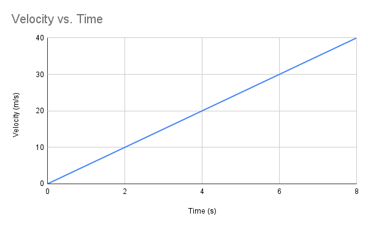

Slope formula is represented as y = mx + b. Notice a similar equation above? $v_f = v_i + at$ can be rearranged to $v_f = at + v_i$. Now, each variable is aligned. y is equivalent to $v_f$, m is equivalent to a (the slope), x is equivalent to t, and b is equivalent to $v_i$ (initial velocity).

The other three equations are proportional to different graphs and situations. Each is suited to accurately give a variable quantity, but you must choose the correct one. An easy way to identify a viable equation is to look for one without a known variable. Of course, make sure it contains the variable you are solving for and those that are known 

Analyze the graph below (uniform acceleration of $5 m/s^2$):

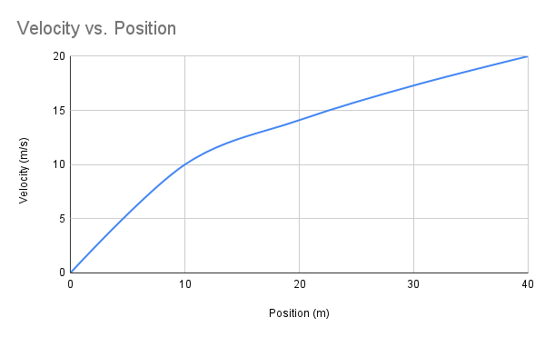

Which equation is represented by the graph? That would be $v_f^2 = v_i^2 + 2a\Delta x$. This is because each variable is present in the graph. We can rearrange the equation to solve for position or velocity. If you calculate velocity from position data, you will get the equation v = $\sqrt{2ax}$, meaning linearization can increase clarity and better interpretation. Since we determined this graph to be a square root function, the data is viewed as $v \propto \sqrt{x}$ but is easier read as $v^2 \propto x$. Now we can adjust our data to fit this attempt at linearization:

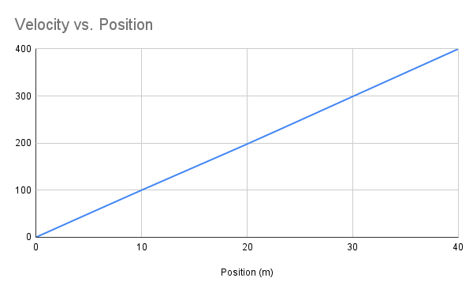

Ahh! Now it's linear! Notice the data changes below:

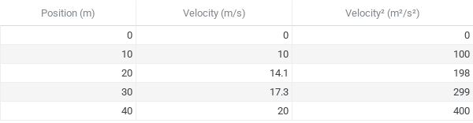

Note that this is applicable to each of the equations mentioned above, deriving equations from graphs and linearizing them are important. Both contributed to the creation and use of kinematic equations. Remember that linearization clarifies relationships between variables, which are obscure in curved graphs.

### Key Takeaways

* Kinematic equations can be derived from graphs and data sets
* Rearrange equations to solve for patterns (you could even make $\Delta x = v_i t + \frac{1}{2} a t^2$ represent a slope-intercept formula for a position vs. time graph if initial velocity is 0: $x = \frac{1}{2} at^2 + x_0$)
* Identify proportional relationships to linearize effectively (in the slope-intercept equation above, $x \propto t^2$ or $\sqrt{x} \propto t$)
* If an equation is in slope-intercept form, it will be linear regardless of an exponent as expressed in $x = \frac{1}{2} at^2 + x_0$
* Analyze patterns to find the best suitable equation and what it represents in a graph

### Kinematic Use

Let's integrate kinematic equations into situations. Comparing methods of execution in regards to efficiency and time consumption is a task faced by many. Take Tesla for example, a company advanced in technology but also one exploring their options. Say it wants to create a new prototype that can compete with gas-powered super cars.

* Vehicle A travels with a uniform acceleration of $5 m/s^2$.

* Vehicle B has one half the time to travel with a uniform acceleration of $5 m/s^2$.

**What is the relationship of position between the two vehicles?** Both have an initial velocity of 0.

    
Click here when you have your answer in mind

**The answer is $x_B = \frac{1}{4} x_A$.** The second kinematic equation is best for this, $\Delta x = v_i t + \frac{1}{2} a t^2$.

* $v_i$ = 0
* That leaves $\Delta x = \frac{1}{2} a t^2$
* This means $x \propto t^2$ or $\sqrt{x} = t$
* We know that Vehicle B's time is half the time of A's, so $t_B = \frac{1}{2}t_A$

Now, we can compare:

$\frac{\Delta x_B = \frac{1}{2} a \frac{1}{2}t_B^2}{\Delta x_A = \frac{1}{2} a t_A^2}$

$\frac{\Delta x_B = (\frac{1}{2}t_A)^2}{\Delta x_A = t_A^2}$

$x_B = \frac{1}{4} x_A$ or $4x_B = x_A$.

#### Quick Note

Going back to the proportion $x \propto t^2$, we can actually find our answer much quicker. Since acceleration is the same for both A and B, that makes A $x = t_A^2$ and $x = \frac{1}{2}t_A^2$. When set equal to each other, we divide to get our same answers of $x_A = 4x_B$ and $x_B = \frac{1}{4} x_A$.

### Kinematic Functions

Derivations are central to kinematics because they help in the creation of new equations. We know that average velocity is equal to $\frac {x - x_0}{t}$. This formula is applicable to any types of motion whether variable or constant. But a kinematic version of average velocity is $\frac {v + v_0}{2}$. This means that $\frac {x - x_0}{t} = \frac {v + v_0}{2}$. Remember that $\Delta x = x_f - x_0$. Let's go through five problems to help in choosing and solving the correct kinematic equation. Note that you may need to use multiple kinematic equations to find the correct value.

#### Problem 1

A deer stops then runs across a 10 meter roadway at an acceleration of $2.5 m/s^2$. **How many seconds to get to the other side?** Round to the nearest whole number.

    
Click here when you have your answer in mind

**The answer is 3 seconds.** The deer has an initial velocity of 0 since it stops before running. That makes $\Delta x = v_i t + \frac{1}{2} a t^2$ our best choice. So, $10 = \frac{1}{2} 2.5 m/s^2 t^2$. Then, $10 = 1.25 t^2$. Finally, $\sqrt{8} \approx 2.83$s.

#### Problem 2

A cruise ship travels for 1,000 meters and reaches a peak speed of 20 m/s. **What is the ship's acceleration?** Round to the nearest tenth.

    
Click here when you have your answer in mind

**The answer is $0.2 m/s^2$.** For this one, you must use $v_f^2 = v_i^2 + 2a\Delta x$. Solve for acceleration. $400 m/s = 2a(2,000)$. Then, $400 m/s = 2,000a$. Finally, a = $0.2 m/s^2$.

#### Problem 3

In an airport, a luggage bag is carried on a conveyor belt at a speed of 2 m/s then arrives 20 meters later at a speed of 4 m/s. **How long does the bag take to reach its destination?** Round to the nearest whole number.

    
Click here when you have your answer in mind

**The answer is 7 seconds.** For this one, you must use $\Delta x = \frac{1}{2}(v_i + v_f)t$. We can find out answer directly using this equation. Let's plug in our known values. So, $20 = \frac{1}{2}(2 m/s + 4 m/s)t$. Then, $20 = 3t$. Finally, $t \approx 6.67$s or 7 seconds.

#### Problem 4

A cargo ship reached its halfway point at a velocity of 8 m/s and an acceleration of $0.1 m/s^2$ over 2,000 meters. **What is the ship's final velocity?** Round to the nearest tenth.

    
Click here when you have your answer in mind

**The answer is 21.5 m/s.** For this one, you must use $v_f^2 = v_i^2 + 2a\Delta x$. This equation has each of our known values except for final velocity. So, $v_f^2 = 64 m/s + 2 \times 0.1 \times 2,000$. Finally, $v_f = \sqrt 464 or 21.5 m/s$.

#### Problem 5

A train is delivering essentials for a nearby city. The locomotive traveled for another 600 meters over 40 seconds at a velocity of 15 m/s and an acceleration of 0. **What is the train's final velocity?** Round to the nearest tenth.

    
Click here when you have your answer in mind

**The answer is 15.0 m/s.** For this one, you must use $v_f = v_i + at$. Let's plug in. So, $v_f = 15 m/s + 0 m/s^2 \times 40s$. Finally, $v_f = 15.0 m/s$.

### Free Fall

#### Gravity in Physics

What's the first thing that comes to mind? An apple falling on Newton's head? Well, you're not wrong! Gravity ensures every object that comes up comes down. From a physics standpoint, this can be represented in the same graphs we learned in the previous lesson and quantified with equations.

#### Key Concepts

* The longer an object is in the air, the more it will speed up downwards. Take the graph below for example:

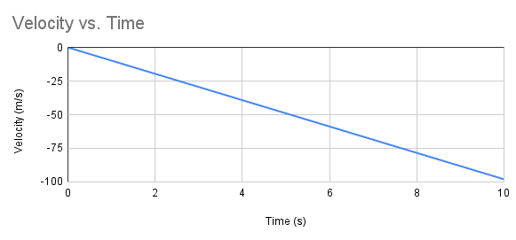

* Acceleration in free fall ALWAYS has negative direction and a magnitude of $-9.8 m/s^2$, meaning its constant
* If an object is thrown, launched, or pushed, its initial velocity is NOT zero, compared to when the object is released
* Choosing a coordinate system is flexible, up can be negative while down can be positive, but values MUST be consistent in your kinematic equations
* Each graph is applicable to free fall but must represent the correct motions
* Velocity is variable while acceleration is constant at $-9.8 m/s^2$
* At the peak of an object's trajectory, velocity will be zero but acceleration will remain at its constant direction and magnitude

#### Graph Analysis

Since the graph above is linear, we will use $y = mx + b$ to describe our motions. The slope can be calculated by $\frac{-98 m/s - 0 m/s}{10s - 0s} = -9.8 m/s^2$. Rearranged, we get $y = -9.8x + 0$. This is also known as our line of best fit.

* y = velocity
* m = acceleration
* x = time
* b = initial velocity

**What is the final velocity of this graph?**

    
Click here when you have your answer in mind

**The answer is -98 m/s.** There are many ways to figure this out. Since the exact velocity end mark is obscure, we can plug in the final x, or time, value of 10s. So, $y = -9.8 \times 10$. Finally, $y = -98 m/s$. 

Let's go through two launched and two released projectiles. Note each explanation.

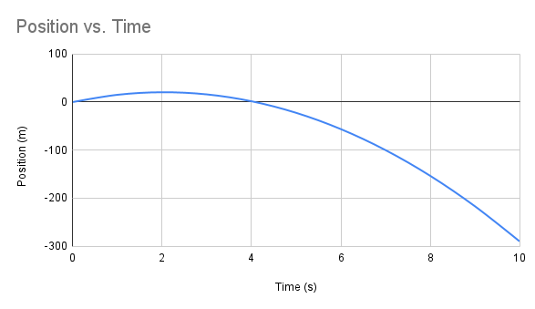

This graph involves a projectile launched upwards. Note the positive but rapid increase in position and then immediate decline once gravity takes hold. Since we are dealing with a parabola, the best equation will be $\Delta x = v_i t + \frac{1}{2} a t^2$. Whenever an object is launched, it will have an initial velocity greater than zero. Let's solve for that value. We can plug in any x value so long that it corresponds to a time. So, $1.6m = v_i(4) - 4.9(4)^2$. Then, $1.6m = 4v_i - 78.4$. Finally, $v_i = 20 m/s$. **What is the object's maximum height?** Round to the nearest tenth.

    
Click here when you have your answer in mind

**The answer is 20.4 meters.** We can approximate a value by looking at the graph. But a more exact precision will require $\Delta x = v_i t + \frac{1}{2} a t^2$. At 2 seconds the object reached its peak, so $\Delta x = 20(2) + \frac{1}{2} -9.8 (2)^2$. Then, $\Delta x = 40 - 19.6$. Finally, $\Delta x = 20.4$ meters.

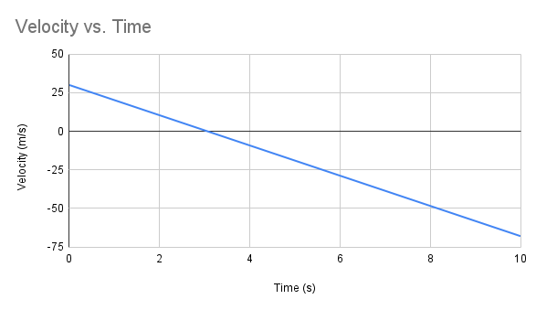

This graph involves a projectile launched upwards. Note the velocity starting above zero. Gravitational acceleration will cause the velocity to slope downwards. Initial velocity is 30 m/s, meaning the object was thrown at that speed and force. Since we are dealing with a linear graph, $v = v_0 + at$ is best to represent each value. To confirm free fall, we can calculate for slope $\frac{-68 - 30}{10 - 0} = \frac{-98}{10} = -9.8 m/s^2$. ✅Free fall confirmed. **When is the object at its maximum height?** Round to the nearest whole number.

    
Click here when you have your answer in mind

**The answer is 3 seconds.** Maximum height indicates a velocity of zero since the object would be stationary for an instant. One can easily find the answer by $0 = 30 - 9.8t$, $-30 = -9.8t$, $t \approx 3s$. Or, you can look on the x-axis when y = 0. Both give you 3 seconds.

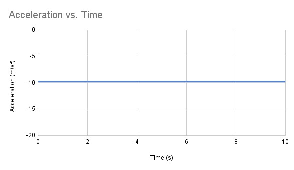

This graph involves a released projectile. Note that even if the object was launched, its data would look identical to the above. An acceleration vs. time graph is universally the same across every free fall scenario. Acceleration is constant at $-9.8 m/s^2$, so a straight, horizontal line at y = -9.8 is accurate.

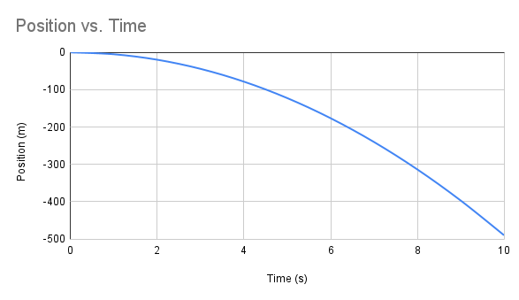

This graph involves a released projectile. Note the steady but negative decrease in position. Since no other force acted on it upon release, initial velocity is zero. The graph is parabolic, meaning we should use $\Delta x = v_i t + \frac{1}{2} a t^2$. This simplifies to $\Delta x = \frac{1}{2} a t^2$. Let's confirm the free fall by finding acceleration. $-490 = \frac{1}{2} a (10)^2$, $-490 = 50a$, $a = -9.8 m/s^2$. ✅Free fall confirmed. **What is the object's maximum height?**

    
Click here when you have your answer in mind

**The answer is 0 meters.** The object was released downwards, so it will not have a peak. This is a key difference between launched and released projectiles.

#### Important Note

Projectiles can be launched downwards too, so they will be reverse to their upward counterparts. Take a look below:

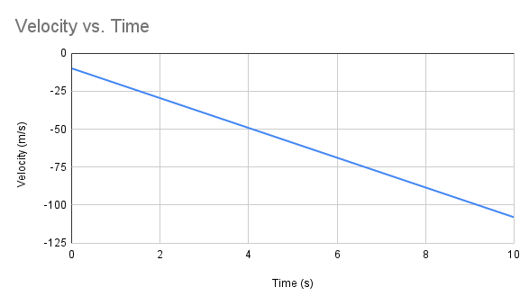

**What is the initial velocity?**

    
Click here when you have your answer in mind

**The answer is -10 m/s.** $v_f = v_0 + at$. $-10$ m/s$ = v_0 - 9.8(0)$, $v_0 = -10$ m/s.

#### Velocity & Acceleration Diagrams

In free fall, velocity and acceleration share a motion visual:

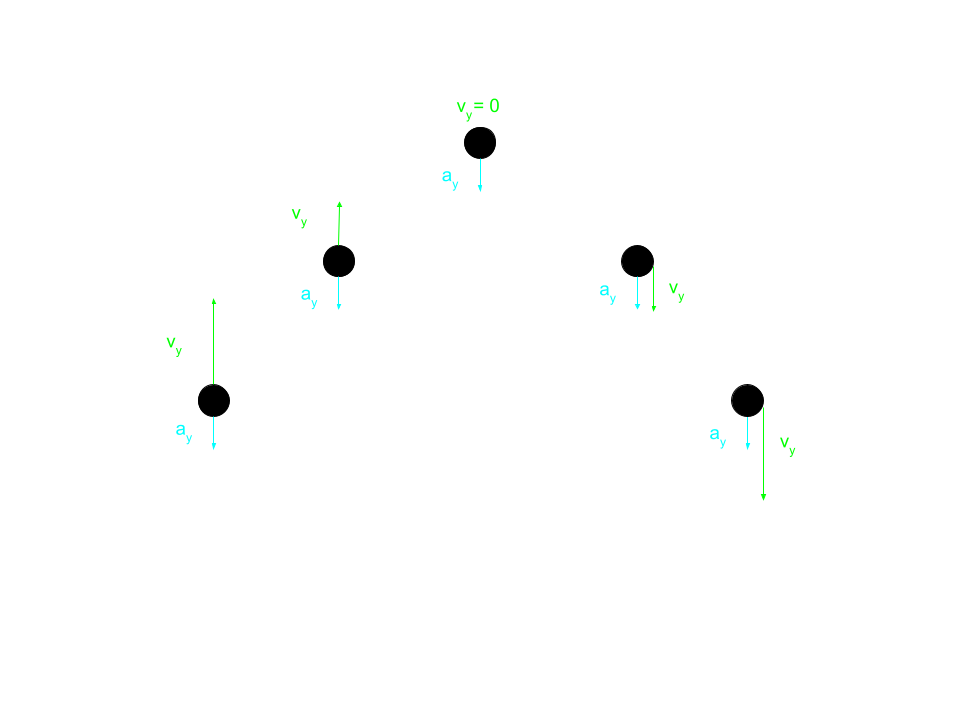

The image above represents vertical velocity and acceleration. Besides graphs, diagrams can convey information just as effectively. When the object starts moving up, velocity gradually decreases. Note that acceleration maintains a constant $-9.8 m/s^2$ throughout the whole motion. At the object's peak, it temporarily stops moving since velocity is zero. **What is happening to the velocity after the peak?**

    
Click here when you have your answer in mind

**Velocity is gradually gaining speed in the negative direction.** Magnitude increases but direction switches from positive to negative. Notice the arrows getting larger on the way down, this indicates an increase in speed.

#### Common Misconceptions

* An object doesn't have to be lighter than another to fall. This is due surface area, another component of air resistance. Take a sticky note and a pencil, at first the pencil would fall faster but once you crumple up the sticky note they will seem even.
* Weight and speed also contribute air resistance
* Air resistance does not affect an object significantly in free fall, including its trajectory
* The coordinate system is arbitrary and reflects personal choice
* Free fall happens when gravity is the only affecting agent, meaning the process starts even when an object is going up

### Think Like a Physicist

An acrobat is performing manuevers on a balance beam. She reaches a peak after 0.20 seconds of being midair. A judge wants to calculate her displacement given that she had an average velocity of 2 m/s. **What is the acrobat's total displacement?** Round to the nearest tenth.

    
Click here when you have your answer in mind

**The answer is 0.8 meters.** The peak of motion represents a halfway point, so total time is $0.20s \times 2 = 0.40s$. One of the average velocity formulae is $\frac{x - x_0}{t}$, which includes displacement! Note that the initial position of this motion is zero. So, 2 m/s = $\frac{x}{0.40s}$. Finally, $x = 0.8$ m.

### Practice

[Let's test your knowledge, take the free fall & kinematics quiz here](Quiz3.html)

## Lesson 4

Our final lesson will be focused on two-dimensional motion. Ensure your geometry is up-to-par because shapes will play a role in concepts and calculations. Graphs will be a significant factor in the content as well. We will be using degrees, but using radians is common too. Configure your calculator to fit the scenario. Let's dive in.

### Vector Components

Components of motion are divided into horizontal and vertical sides. But if a ball is kicked at an angle, it may not fit either of those dimensions. Therefore, we make the components perpendicular to each other. By combining both, we get the length of the total vector (magnitude), also known as the hypotenuse. The vector arrows represent direction across each component, including the total vector. At launch, the hypotenuse reveals an initial vector, be it position, velocity, etc. Theta will quantify the object's angle into degrees. Let's picture this:

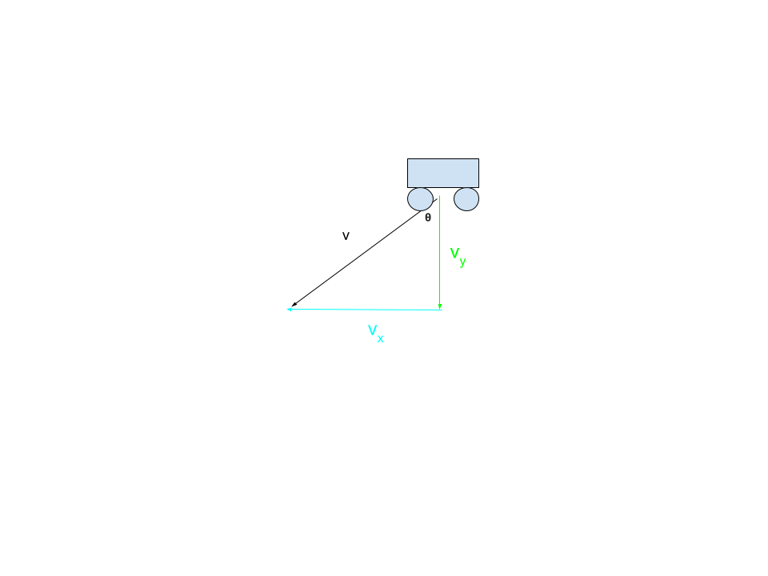

Analyze the horizontal and vertical portions of velocity. Intersecting the vertical and total velocity vectors, a wagon is positioned. Note that the hypotenuse does not indicate trajectory, but rather the total velocity that this situation represents. Theta, although unmarked, gives the exact angle at which this wagon was. For clarity, angles are better represented in degrees. They are important in identifying an object's angular location, and how it is released or thrown.

### Trigonometric Basics

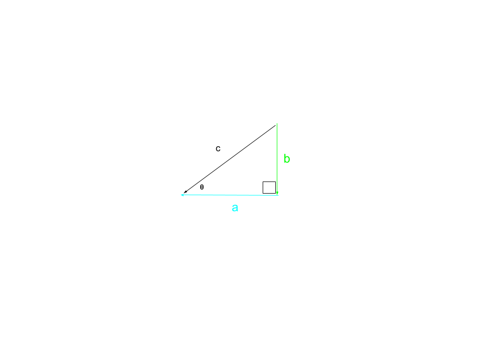

The triangle is labeled a, b, and c on its three sides. **Which letters represent the hypotenuse, opposite, and adjacent sides?**

    
Click here when you have your answer in mind

**A -- adjacent. B -- opposite. C -- hypotenuse.**

#### Trigonometric Functions

Theta is crucial for sine, cosine, and tangent functions. All right triangles use these. The components are perpendicular to better visualize angles. A total vector is formed from its resolved components, and therefore make a right triangle compatible with each law of trigonometry. Memorize the mnemonic soh-cah-toa. From θ on the bottom left, s sine is $\frac{b}{c}$, cosine is $\frac{a}{c}$, and tangent is $\frac{b}{a}$.

* **Sine: $\frac{opposite}{hypotenuse}$**
* **Cosine: $\frac{adjacent}{hypotenuse}$**
* **Tangent: $\frac{opposite}{adjacent}$**

#### Vector Arrows

Triangular arrows are crucial in geometric physics. They show the direction of a vector among every component: vertical, horizontal, and total. The hypotenuse, or total vector, will reflect the direction of its adjacent and opposite sides. Take the triangle above for example. Assuming right is positive and down is negative, every component is negative. The hypotenuse is completely negative because its arrow faces left and down!

Picture the situation below:

A man runs two meters to the left and four meters up a ladder. **Which vector represents the total position component?**

A. 
B. 
C. 
D. 

    
Click here when you have your answer in mind

**B is the correct answer.** The total vector arrow must match that of its horizontal and vertical components. 

It's better to draw the scenario than to imagine it. Note the drawing below:

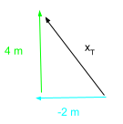

The horizontal arrow points to the left, and the vertical arrow points up. The total vector arrow points in both directions. Note the position values. The hypotenuse is unknown, **what can we do to reveal its magnitude? Round to the nearest tenth.**

    
Click here when you have your answer in mind

**We can reveal the magnitude by using the pythagorean theorem.** Note that the adjacent side is negative. Any of the two components can be positive or negative. However, the total vector must be positive. This is because the length of the vector, also known as the distance or magnitude, is a scalar quantity. Remember to correspond and match each vector arrow in a two-dimensional diagram. Also note that theta, or the angle in degrees, represents total vector's direction. However, the components determine its magnitude.

**What is the value of the hypotenuse?**

    
Click here when you have your answer in mind

**The answer is 4.5 m.** We must use the equation $a^2 + b^2 = c^2$. Let's plug in, $(-2)^2 + (4)^2 = c^2$. So, $4 + 16 = c^2$. Finally, $\sqrt{20} = 4.5$ m.

### Trigonometric Values

Trigonometry in physics will also produce numbers. Let's take a peak at the image below:

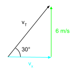

Recall the trigonometric functions and the mnemonic soh-cah-toa.

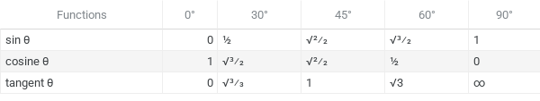

Using these tools, **find the value for the total vector and its missing component.**

    
Click here when you have your answer in mind

**The total vector is 12 m/s and its component is 10.4 m/s.** Solving for the total vector first, let's use sine. Opposite from the angle is 6 m/s and hypotenuse is unknown. So, sine($30^\circ$) = $\frac{6 m/s}{v_T}$. Then, $v_T \times$ sine($30^\circ$) = 6 m/s. On the table, sine($30^\circ$) is equal to $\frac{1}{2}$. Divide $\frac{1}{2}$ by 6 m/s. Finally, $\frac{6}{1} \times \frac{2}{1}$ = 12 m/s. Now let's solve for the component, tangent is best for this. Opposite from the angle is 6 m/s and adjacent is unknown. So, tan($30^\circ$) = $\frac{6 m/s}{v_x}$. Then, $v_x \times$ tan($30^\circ$) = 6 m/s. Divide tan($30^\circ$) by 6 m/s. Finally, $v_x \approx 10.4$.

Let's explore the use of inverse tangent. Commonly known as arctangent, this function is used to find angles. Let's picture this.

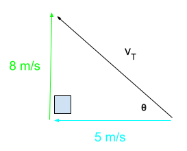

The angle is unknown, but its opposite and adjacent sides from are not. tan ***θ*** = $\frac{8}{5}$. Now switch, ***θ*** = tan$^-1$ ($\frac{8}{5}$). Plug into a calculator. Finally, the angle is 58$^\circ$ rounded to the nearest whole number.

Analyze the image below. **Which of the following values are equal to $\frac{b}{c}$?**

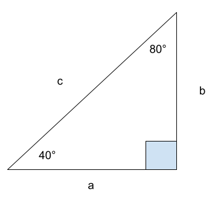

A. sin($40^\circ$)
B. cosine($40^\circ$)
C. tangent($40^\circ$)
D. sin($80^\circ$)
E. cosine($80^\circ$)
F. tangent($80^\circ$)

    
Click here when you have your answer in mind

**The answers are A and E.** For A, opposite to $40^\circ$ is b. Hypotenuse is c. The sine functions produces $\frac{b}{c}$. For E, adjacent to $80^\circ$ is b. Hypotenuse is c. The cosine function produces $\frac{b}{c}$.

### Projectile Motion

When analyzing motion in two dimensions, we will treat the horizontal and vertical components separately and independently. They do not affect each other. Trigonometry gave a foundation for the mechanics of 2D motion. Let's look at released and launched projectiles.

Three steel balls are launched by catapults at an angle. **Which of them below has the highest vertical height, longest air time, and greatest horizontal distance?**

    
Click here when you have your answer in mind

**The second steel ball has the highest vertical height and the longest air time. The first steel ball has the greatest horizontal distance.** To determine vertical height, look for a parabola or peak. In this case, the second ball has the highest. To determine air time, look for the highest vertical velocity. In this case, the second ball has the longest. Note that the greatest angle will produce a high vertical velocity. Now, horizontal distance is a bit different. It involves time length and horizontal speed. Both are determined by the two velocity dimensions. Meaning a balance is key to maximize horizontal distance. A launch angle closest to $45^\circ$ will do the job. Of course, the first steel ball is the best candidate.

Remember to merge this material with the triangles we covered previously.

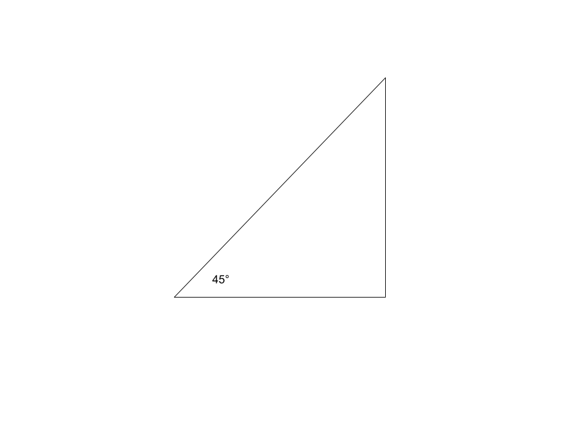

The launch angle is at a balanced $45^\circ$. Physics can take on many forms. Get to a comfortable level with trigonometry.

Look at the graphs below. **Why do you think horizontal velocity stays constant unlike its vertical counterpart?**

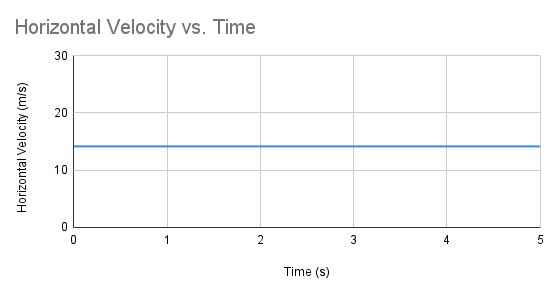

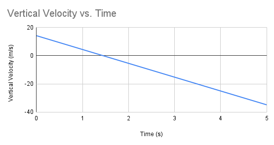

    
Click here when you have your answer in mind

**Horizontal velocity stays constant because gravity only affects vertical motion.** There are zero forces present in the horizontal dimension. We know that gravity affects acceleration (g = -9.8 m/s$^2$), so that would mean horizontal velocity does not have any. In other words, it stays constant. Launched at an angle, both vertical and horizontal components will have the same initial velocity. But vertical velocity is the only one changing constantly.

Remember to use different graphs for the two dimensions.

Let's focus on the numbers aspect now.

### Dimensional Calculations

Analyze the graph below. **What is the vertical displacement?**

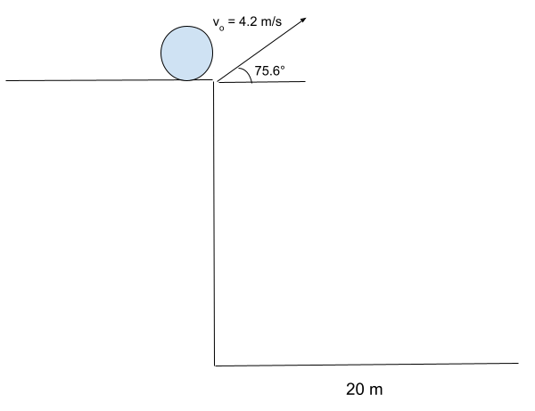

    
Click here when you have your answer in mind

**The answer is -102 m.** To find vertical displacement, we must first calculate time. Take $\Delta x = v_i t + \frac{1}{2} a t^2$. First, let's determine initial horizontal velocity. cos(76$^\circ$) = $\frac{a}{4.2}$. a $\approx$ 1 m. Now plug in, 5 = 1 $\times$ $t_x$. So, t = 5s. Let's determine initial vertical velocity. sin(76$^\circ$) = $\frac{o}{4.2}$. o $\approx$ 4.1 m. Plug in again, $\Delta y = 4.1 \times 5 + \frac{1}{2} -9.8 (5)^2$. Simplify to $\Delta y = 20.5 - 122.5$. Finally, $\Delta y$ (vertical displacement) = -102 m. Remember that vertical displacement is on the y-axis, and blank on this diagram to strengthen your identification skills.

#### Quadratic Formula

The quadratic formula will be used in certain physics problems. Take the one we just did for example. 

Now, obviously we didn't know the vertical displacement beforehand. But if we did, $\Delta y = v_i t + \frac{1}{2} a t^2$ would be used. Plug in, $-102 = 4.1t - 4.9t^2$. Set equal to zero, $-4.9t^2 + 4.1t + 102 = 0$. Focus on the three. a = -4.9. b = 4.1. c = 102. Next, find the value of t using the quadratic formula. **Find the two values yourself.**

    
Click here when you have your answer in mind

**The answers are -4.2 and 5.** Let's solve for time. Recall, $\frac{-b \pm \sqrt{b^2 - 4ac}}{2a}$. Now solve, $\frac{-4.1 \pm \sqrt{16.81 + 1999.2}}{-9.8}$. Then, $\frac{-4.1 \pm 44.9}{-9.8}$. Finally, we get -4.2 and 5. Time cannot be negative, so **5 seconds is the correct answer.**

##### Quadratic Application

You will have to use the quadratic formula more than you think. In physics, you will encounter real-world scenarios. So, let's shift our focus from learning this equation to applying it.

**How long is the football in the air before hitting the ground?**

    
Click here when you have your answer in mind

**The answer is 2.5 seconds.** Combine $\Delta y = v_i t + \frac{1}{2} a t^2$ with the quadratic formula. Remember that vertical, not horizontal, displacement is negative if we assume down as the negative direction. Solve for initial vertical velocity, sin($22^\circ$) = $\frac{o}{6.2}$. o $\approx$ 2.3 m/s. So, $-25 = 2.3t - 4.9t^2$. Set equal to zero, $-4.9t^2 + 2.3t + 25 = 0$. Focus on the three. a = -4.9. b = 2.3. c = 25. Now use the quadratic formula. $\frac{-2.3 \pm \sqrt{5.29 + 490}}{-9.8}$. Simplify, $\frac{-2.3 \pm 22.3}{-9.8}$. Finally, we get -2s and 2.5s. Time cannot be negative, so **2.5 seconds is the correct answer.**

### Dimensional Problems

#### Problem 1

A test missile is launched vertically at a speed of 100 m/s and reaches a peak after 20 seconds. Assume up and rightward is the positive direction. **What is the vertical displacement?** Bonus: what is the horizontal displacement?

Tip: create a graph

Round to the nearest whole number.

    
Click here when you have your answer in mind

**The vertical displacement is 40 meters and the horizontal displacement is 0 meters.** Since we want the missile's vertical displacement at its peak, we know our answer has to be positive (up is classified as such). Use $\Delta y = v_i t + \frac{1}{2} a t^2$. Plug in, $\Delta y = 100(20) - 4.9(20)^2$. Solve, $\Delta y = 2,000 - 1,960$. Finally, $\Delta y = 40$ m. Since the missile is launched vertically, there will be zero horizontal displacement. If an object is launched horizontally, there would be displacement across both dimensions assuming it falls.

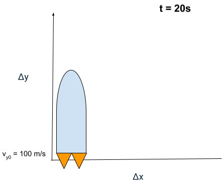

#### Problem 2

An archer is practicing for a national tournament. He releases an arrow horizontally and hits a target 35 meters away before falling for 10 meters. Assume up and rightward is the positive direction. **What is the initial horizontal velocity?** Bonus: what is the initial vertical velocity?

Tip: create a graph

Round to the nearest whole number.

    
Click here when you have your answer in mind

**The initial horizontal velocity is 25 m/s and the initial vertical velocity is 0 m/s.** Use $\Delta x = v_i t + \frac{1}{2} a t^2$. Plug in, $35 = v_i t$. We need to find the value of t. Let's switch to $\Delta y = v_i t + \frac{1}{2} a t^2$. Plug in, $-10 = -4.9t^2$. Now, t $\approx$ 1.43. Switch over to $35 = v_i t$. Plug in, $35 = 1.43 v_i$. Finally, $v_i = 25$ m/s. Since the arrow is launched horizontally, there will be no initial vertical velocity. And vice versa.

### Think Like a Physicist

A dart is thrown with a velocity of 4 m/s and lands on the board 5 seconds later. **Draw dimensional graphs for velocity, acceleration, and position that most accurately represent the situation described.**

    
Click here when you have your answer in mind

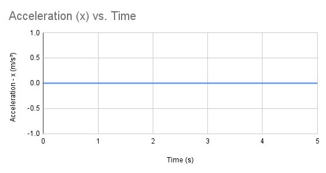

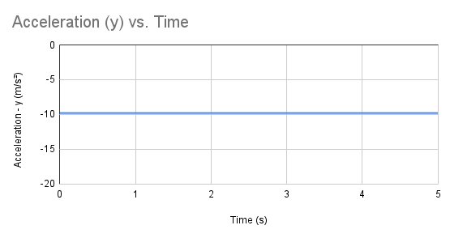

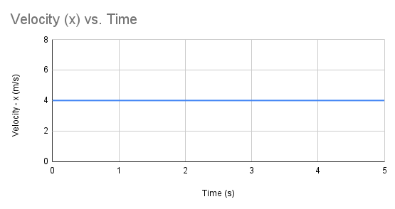

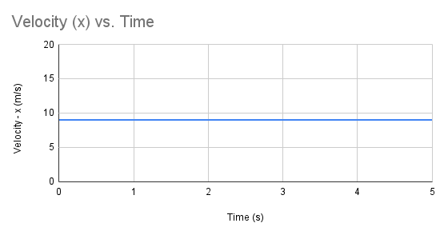

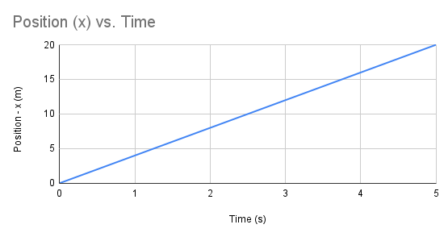

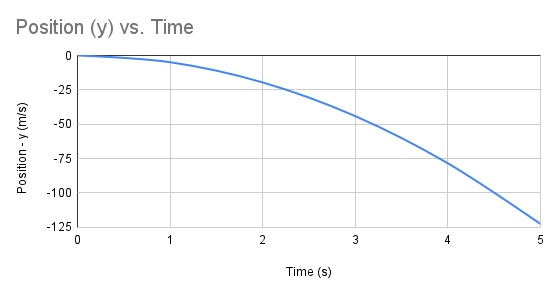

Analyze the graphs above and remember that the dimensions (x,y) are treated independently from each other. Recall the rules for them (i.e. x has zero acceleration while y maintains -9.8$m/s^2$).

### Practice

[Let's test your knowledge, take the dimensions & trigonometry quiz here](Quiz4.html)

## Recap

Congrats! You have finished Unit 1. If you flew through it, then the next units will be the same. Mastering physics does not only take skill, but also confidence. Kinematics focused on motion without regard to forces such as wind and air resistance. Gravity being the only exception. Definitions and variables were key to understanding these basic concepts. Below, you will dive deeper and explore what the unit has left out.

# Unit 2: Torque & Rotational Dynamics

### Lesson 1

