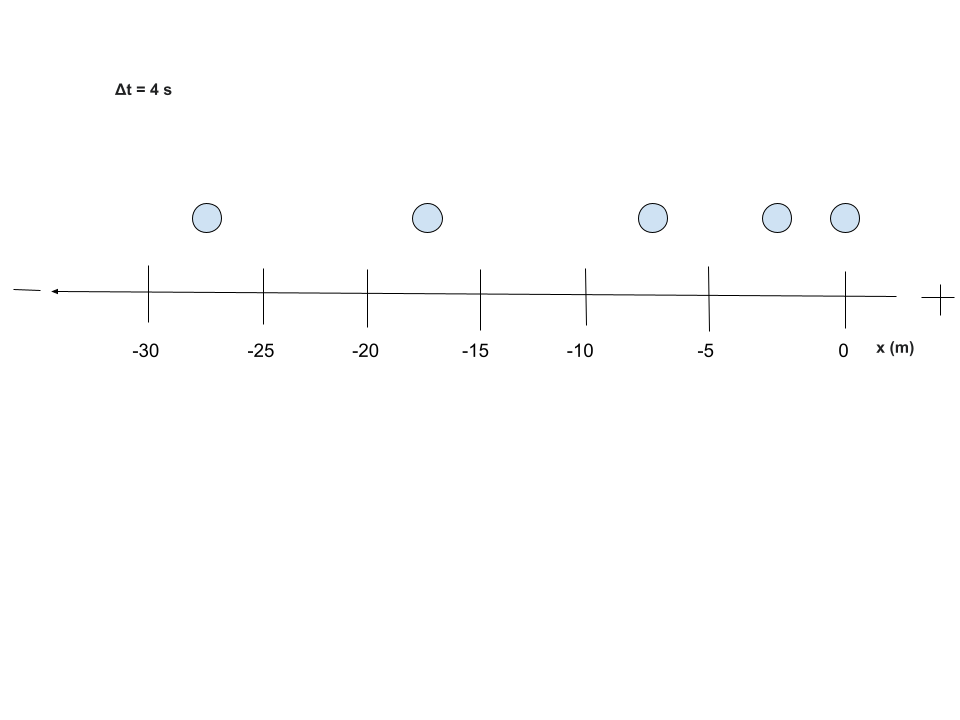

Welcome! I am delighted to be your mentor through one of the hardest classes you will take in high school, but by the end of your experience, these tricky concepts will transform into basic logic. College Board has notoriously made this course one of its most challenging, but after you give me a little bit of your time and attention each day, I guarantee that you will get something out of this. It is my passion to help students feel less pressure in the classroom, so I made this guide as beginner-friendly as possible. Let's start with Unit 1: Kinematics.

## KINEMATICS: Lesson 1

Before we start, let's learn a few essential key points and definitions. Kinematics combines algebra and geometry to analyze motion in objects but ignores the effects of forces, which will play a role in an object's motion as the course develops.

### Key Terms and Definitions

#### Scalar - a physical quantity that only has magnitude (no direction)

* Speed - how fast an object is moving, the rate at which it covers distance
* Magnitude - the size or strength of a physical quantity, without reference to direction
* Temperature - a measure of the average kinetic energy of the particles in a substance
* Volume - the amount of space an object occupies
* Energy - the ability to do work or cause change
* Mass - measure of matter in an object
* Distance - the total length that an object has traveled

#### Vector - a physical quantity that has magnitude AND direction

* Velocity - the rate of change of position
* Acceleration - the rate of change of velocity
* Position - the location of an object in a 1d or 2d shape
* Displacement - the change of position over time

### Symbols

#### Velocity
$$\vec{v}$$

#### Acceleration
$$\vec{a}$$

#### Position
$$\vec{x}$$

#### Displacement
$$\Delta\vec{x}$$

Now, I want you to look carefully at these symbols and try to identify which are vector quantities and which are scalar quantities.

    
Click here when you have your answer in mind

Actually, they are all vector quantities! If we scroll above, we will see that scalar quantities do not have direction, while vector quantities do. The arrow above each variable represents direction in physics. The variable itself represents magnitude, which is the only factor that makes up a scalar quantity.

Next, I want you to think of the term scalar, how can we transform a vector quantity into a scalar quantity? Remember its definition and key points, a scalar value only represents a vector's magnitude. In other words, we can remove the arrow from each vector quantity to create a scalar quantity. For example, $v$ no longer represents velocity, it now represents speed which is the magnitude of velocity, all because the arrow was removed. Not every scalar quantity of a vector has a name, however, so we can just say magnitude of acceleration to prove our point.

#### Key Takeaways

* Magnitude is always positive
* Scalar and vector quantities are closely related, but different in definition
* Arrow represents direction
* Variable represents magnitude
* $\Delta$ represents change over time

#### Further Information

* Vectors can be positive or negative values
* Basic scalar quantities are positive
* The point of reference (reference point) is usually set to 0 and represents the **initial position** of an object
* The conventional coordinate system follows a left/down = negative and right/up = positive pathway
* Make sure you can visualize every physics problem!

#### Think Like a Physicist

This section will be present in each lesson and is used to cover conceptual physics. Of course, the material above is essential to a full understanding of the situation below:

**A truck hits its brakes too late and stops past an intersection onto the crosswalk. The vehicle then backs up at constant acceleration until it comes to a full stop behind the pedestrian walkway. Describe the magnitude of acceleration and velocity (speed).**

    
Click here when you have your answer in mind

The magnitude of acceleration is not changing since it is constant in this scenario, but the magnitude of velocity (speed) is increasing steadily due to constant acceleration and a gradual gain of speed. Even though the direction of velocity and acceleration is negative, the magnitude must stay positive and reflect only the quantity of a vector without reference to direction, which can be referred to as the scalar portion. An easy way to find the magnitude of any vector value is to take its absolute value.

#### Practice

[Let's test your knowledge, take the vector & scalar quiz here](Quiz.html)

## Lesson 2

Now that we have a basic understanding of kinematics concepts, we can start learning the numbers aspect of the unit. Let's get familiar with a few equations while visualizing each variable at play. But remember to focus more on understanding physics conceptually, not mathematically.

### Kinematic Equations

$$v_f = v_i + at$$

$$\Delta x = v_i t + \frac{1}{2} a t^2$$

$$v_f^2 = v_i^2 + 2a\Delta x$$

$$\Delta x = \frac{1}{2}(v_i + v_f)t$$

***Note that f represents final and i represents initial, also note that t means time***

Keep the above equations in mind and use them only when acceleration is constant, each one is missing a variable to help you better identify which is best for a certain physics problem. These are central to kinematics, so ensure your algebra is up-to-par.

### Specific Variables

* $\vec{v}_inst$ ---> (represents the instantaneous velocity of a motion graph at a single point in time, found by calculating the slope of a straight, linear line)

* $\vec{v}_avg$ = $\Delta x / \Delta t$ ---> (represents the average velocity of a motion graph over the whole time period)

* $\Delta v = v_f - v_i$ ---> (represents the change of velocity over a chosen time interval on a motion graph)

* $a = \frac{\Delta v (v_f - v_i)}{\Delta t}$ ---> (represents acceleration or the rate of change in velocity)

### Algebra in Physics

Algebra is central to AP Physics 1, but it is not the only factor when dealing with numbers in the course. Most problems you will encounter are not plug-n-chug style but rather require a more intuitive, conceptual understanding of each variable's role in physics scenarios. Let's look at a few examples to solidify conceptual and algebraic comprehension.

The image above is called a motion diagram. These typically do not involve numbers and, therefore, rely on conceptual intuition, so try and figure out how each variable works to form a motion diagram as I explain. The arrows are pointing to the right, which in this coordinate system, represents the positive direction. We can safely say that the object (let's say car for this example) is not going backwards but rather forwards. The dots represent the vehicle's position, which increases over time, and the length of the arrows represents velocity. The car's initial velocity is higher than its velocity during the rest of the trip, meaning the vehicle decelerated to maintain a constant velocity after its initial recorded position and velocity. We can see this because, at first, the arrow goes from one vertical line to the next but then gets shorter and goes from half of a vertical line to the next and so forth.

Let's take a look at another conceptual diagram but in reference to time:

Notice the $\Delta t$. Each time interval, or the time between each dot, is one second. The first dot will always represent zero seconds. In this case, we are going forwards to keep the concepts simple, but if we were going backwards then 0 seconds would start to the far right rather than the far left. The velocity would be negative and the distance data, or x axis, would be different as well.

How much of the initial velocity is the constant velocity?

A. 2 times as much

B. $\frac{1}{2}$ as much

C. 4 times as much

D. $\frac{1}{4}$ as much

    
Click here when you have your answer in mind

Correct answer: A.

Since the constant velocity will be the same amount each time (2.5 m/s), we can compare any of its intervals to the initial velocity of 5 m/s, remember that we get these values because velocity is defined as the rate of change of position (displacement) per second. 5 is two times the amount of 2.5, so that makes A the correct answer.

Let's take a look at simpler models called oil-drop or particle diagrams. Since motion diagrams are more complex, see if you can interpret the example below:

With limited information, I want you to describe the direction and speed of the object. For more advanced students, try and interpret out the acceleration too. Hint: the model is very similar to a motion diagram. Once you have it figured out, check your answers below:

    
Click here when you have your answer in mind

Remember that speed only deals with magnitude, meaning it will be positive regardless of direction. The speed of the object is increasing because each dot is spacing out more and more, or in other words the position is increasing after each interval, which is four seconds between every dot. The object is becoming more negative, which means vectors like velocity and acceleration will be negative values. Now that we have determined the direction to be negative, we can look at the magnitude of acceleration. The change of position, or displacement, is doubling each time which makes velocity (the rate of change of position, or displacement) increase. Since velocity is not increasing by the same value each time but instead increasing exponentially (2 times each interval) then that makes acceleration an increasing value not a constant one. Note that acceleration is getting more negative, it is not increasing in the positive direction.

The graph above represents position vs. time. These are effective at describing three variables. Can you figure out the third one? It's velocity! Specifically, the slope of the graph is, so this graph shows more than at first glance. One can find the instantaneous and average velocity just from this graph. Instantaneous velocity is found by drawing a tangent line at the point of interest and calculating the slope of it. Average velocity is found only along a certain time interval from one point to another, which can be from start to finish or from two particular points of interest. Try to find the average velocity from t = 0s to t = 4s. We will discuss instantaneous velocity in a moment.

    
Click here when you have your answer in mind

The average velocity from t = 0s to t = 4s is 5 m/s. If we calculate the average velocity from t = 0s to t = 10s, we will get the same value. This is because the line is linear, or from a physics standpoint, the velocity is constant. The slope will be the same from any time interval. Since velocity is constant, acceleration will come out to zero (no acceleration present).

Now we can focus on instantaneous velocity. 